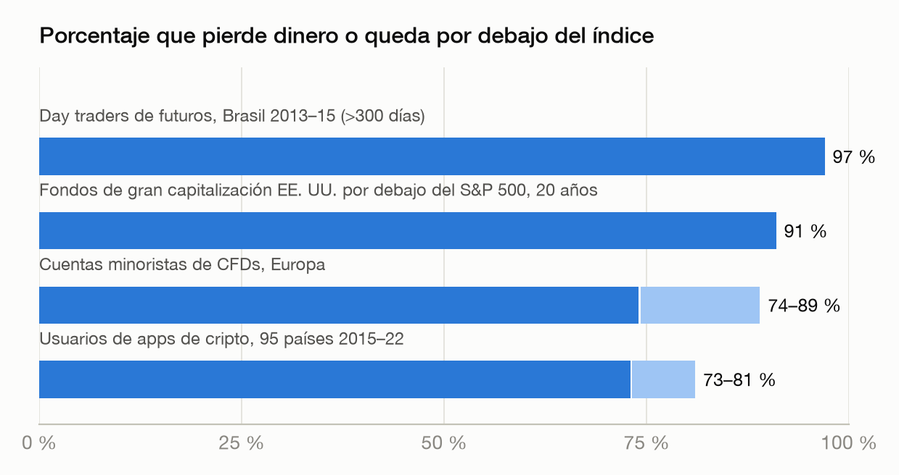
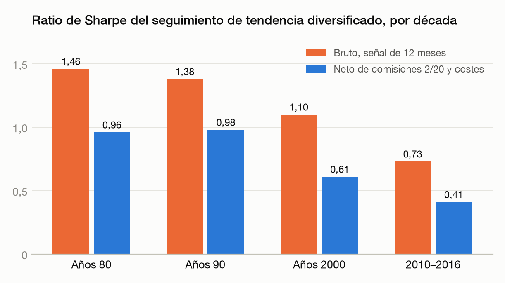
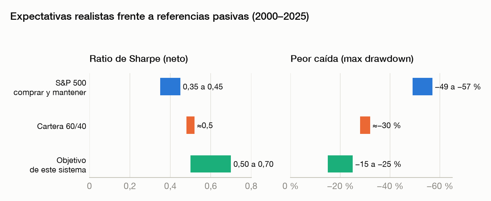
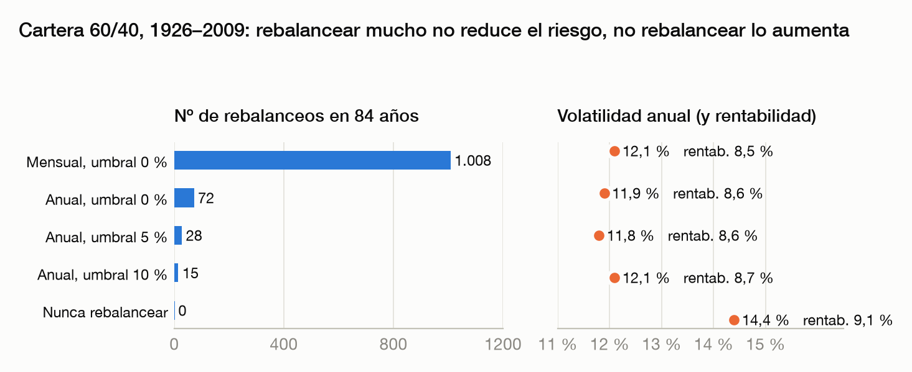
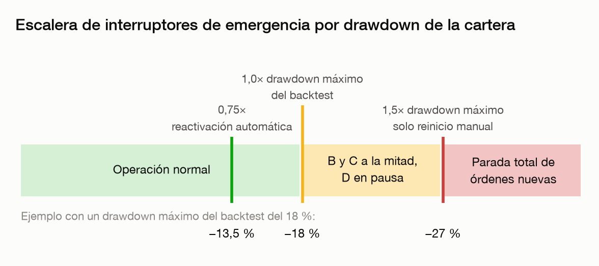
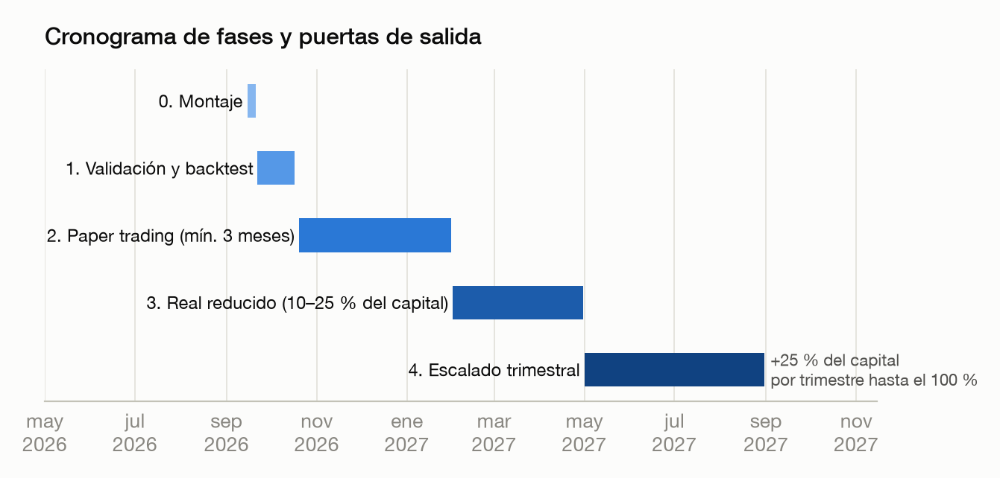

# Sistema de Trading Sistemático sobre Alpaca

**Versión:** 0.2 (borrador para revisión)
**Fecha:** 12 de septiembre de 2026
**Estado:** propuesta inicial. La v0.2 añade el sleeve D (satélite intradía de alto riesgo) a petición de Iván; la elección de estrategia y presupuesto fue criterio de Claude. Nada de lo que hay aquí se ha backtesteado todavía. Los parámetros marcados como *pre-registrados* son la hipótesis inicial, fijada antes de mirar los datos para que el backtest no los contamine.

---

## 0. Resumen ejecutivo

Vamos a construir un sistema que gestione una cartera de ETFs de EE. UU. y, opcionalmente, Bitcoin y Ethereum, a través de la API de Alpaca. El sistema toma todas las decisiones con reglas escritas y auditables. Ni Iván ni Claude operan a mano.

**Qué es:** una cartera con cuatro componentes ("sleeves"):

| Sleeve | Peso inicial | Qué hace | Horizonte que cubre |
|---|---|---|---|
| A. Núcleo estratégico | 60 % | Cartera diversificada con rebalanceo por bandas y aportes periódicos | Largo plazo (5+ años) |
| B. Tendencia en ETFs | 25 % | Seguimiento de tendencia mensual sobre 5 clases de activo, se refugia en letras del tesoro cuando la tendencia es negativa | Mediano plazo (1–3 años) y protección en caídas |
| C. Tendencia en cripto | 10 % máx. | Largo o en efectivo en BTC/ETH con señales lentas y tamaño ajustado a volatilidad | Diversificador, alta volatilidad |
| D. Satélite intradía | 5 %, presupuesto cerrado | Opening Range Breakout de 5 minutos sobre QQQ, ejecutado con TQQQ/SQQQ, sin posiciones nocturnas. Se trata como matrícula: puede perderse entero | Muy corto plazo (intradía), riesgo alto |

Sobre B y C se aplica un control de volatilidad que reduce exposición cuando el mercado se vuelve turbulento. El sleeve D tiene su propio presupuesto y sus propios límites de pérdida, y nunca recibe dinero de los otros tres. Sobre toda la cartera hay interruptores de emergencia que nadie puede saltarse.

**Qué esperar (neto de costes, si todo va razonablemente bien):**

| Métrica | S&P 500 comprar y mantener (2000–2025) | Cartera 60/40 | Objetivo de este sistema |
|---|---|---|---|
| Rentabilidad anual compuesta | ~8 % | ~7–8 % | 6–9 % |
| Volatilidad anual | 15–18 % | 11–12 % | 9–12 % |
| Peor caída (max drawdown) | −49 % a −57 % | ~−30 % | −15 % a −25 % |
| Ratio de Sharpe | 0,35–0,45 | ~0,5 | 0,5–0,7 |

**Qué NO es:** no es una máquina de hacer dinero a corto plazo. La evidencia es contundente en que el trading activo de particulares pierde dinero (sección 1). El objetivo a corto plazo de A, B y C es *no perder de forma estúpida*, ejecutar sin errores y medir bien. Las ganancias, si llegan, llegan en años, no en semanas. El sleeve D es la excepción controlada: el 5 % del capital busca beneficio intradía con una estrategia documentada pero discutida, y con reglas que lo apagan solo si pierde la mitad de su presupuesto.

**Cómo aprende:** con tres bucles separados (operativo automático, estadístico mensual, de decisión trimestral) y una regla central: los parámetros solo cambian en revisiones programadas, con hipótesis registradas de antemano y evidencia estadística. Nunca después de un mes malo. Detalle en la sección 11.

**Plan:** 1 semana de montaje, 3–4 semanas de backtest y validación, mínimo 3 meses en cuenta simulada (paper), luego dinero real con el 10–25 % del capital objetivo y escalado trimestral.

---

## 1. Principios y verdades incómodas

Este sistema se diseña asumiendo que las siguientes cosas son ciertas, porque la evidencia lo respalda:

**1.1 El trading activo de particulares pierde dinero.**
- Barber y Odean (2000), 66.465 hogares de EE. UU.: el quintil más activo ganó 11,4 % anual frente al 17,9 % del mercado.
- Chague, De-Losso y Giovannetti (2020), todos los day traders de futuros de Brasil 2013–2015: de los que persistieron más de 300 días, el **97 % perdió dinero**. Solo el 1,1 % ganó más que el salario mínimo. Sin evidencia de aprendizaje con la experiencia.
- Barber, Lee, Liu y Odean, todos los day traders de Taiwán 1992–2006: resultado agregado neto de comisiones negativo los 15 años; menos del 3 % es predeciblemente rentable; el 80 % abandona en dos años.
- ESMA (2018): 74–89 % de las cuentas minoristas de CFDs pierden dinero.
- BIS (2022), 95 países: el 73–81 % de los usuarios de apps de cripto probablemente perdió dinero.

**1.2 Los profesionales tampoco ganan al índice.** SPIVA mitad de 2025: el 91 % de los fondos de gran capitalización de EE. UU. quedó por debajo del S&P 500 a 20 años. A 15 años y ajustado por riesgo, el 98,2 %.




**1.3 Las anomalías se degradan al publicarse.** McLean y Pontiff (2016), 97 anomalías publicadas: rendimiento un 26 % menor fuera de muestra y un **58 % menor tras la publicación**. Regla de diseño: asumir la mitad del Sharpe del backtest.

**1.4 Los backtests mienten con facilidad.** Bailey, Borwein, López de Prado y Zhu (2014): con 5 años de datos diarios bastan 45 variantes probadas para que la mejor muestre un Sharpe ≥ 1 por puro azar. Zakamulin (2014) mostró que gran parte de la literatura sobre medias móviles tenía un sesgo de anticipación (look-ahead) de un mes que, corregido, deja el resultado estadísticamente indistinguible del comprar y mantener.

**1.5 Lo que sí tiene evidencia robusta y persistente**, aunque degradada:
- Diversificación y rebalanceo (Vanguard 2010, 2022).
- Seguimiento de tendencia diversificado (Hurst, Ooi y Pedersen 2017: 137 años, 67 mercados, Sharpe neto 0,76; pero cayó a 0,41 en 2010–2016).
- Momentum (Asness, Moskowitz y Pedersen 2013: Sharpe 0,74 en todas las clases de activo).
- Control de volatilidad como reductor de colas, no como fuente de alfa (Harvey et al. 2018; Cederburg et al. 2020).




**1.6 Consecuencias de diseño:**
1. Frecuencia baja (mensual y decenal), porque los costes y el ruido destruyen las estrategias rápidas.
2. Reglas simples con pocos parámetros, elegidos por teoría y literatura, no por optimización.
3. Conjunto (ensemble) de señales en vez de una sola, para reducir la dependencia de un parámetro afortunado.
4. Sin apalancamiento, sin cortos, sin derivados.
5. Todo cambio pasa por un proceso con registro de intentos y umbrales estadísticos.

---

## 2. Objetivos por horizonte y definición de éxito

El usuario pidió "ganancias a corto, mediano y largo plazo". Traducido a lo que la evidencia permite prometer:

### 2.1 Corto plazo (mes a mes, primer año)
- **Éxito significa:** el sistema hace exactamente lo que dice el documento; cero discrepancias sin explicar entre posiciones esperadas y reales; costes reales dentro de 1,5× del modelo; ningún incidente crítico sin postmortem.
- **Éxito NO significa ganar cada mes.** Una estrategia con Sharpe anual 0,6 tiene un Sharpe mensual de ~0,17, lo que implica aproximadamente **57 % de meses positivos**. Cuatro de cada diez meses serán negativos aunque todo funcione perfectamente.
- Lo único que puede aportar rendimiento a corto plazo es la protección frente a caídas del sleeve B y el rebalanceo del A. No hay mecanismo de "ganar rápido" y no lo va a haber.

### 2.2 Mediano plazo (1–3 años)
- **Éxito significa:** volatilidad realizada dentro de ±25 % del objetivo; drawdown máximo menor que el del S&P 500 en el mismo período; Sharpe realizado ≥ al de una cartera 60/40 pasiva.
- **Lo que hay que aceptar:** a 3 años no habrá certeza estadística. Con Sharpe 0,6, el estadístico t a 3 años es ~1,0. Se necesitan unos 11 años para t = 2. Faber ganó al índice solo 3 de los 7 primeros años fuera de muestra y la estrategia de Antonacci quedó por debajo del 60/40 durante 12 años. Rachas de 2–3 años por debajo del índice son el precio esperado.


### 2.3 Largo plazo (5+ años)
- **Éxito significa:** rentabilidad compuesta comparable a la renta variable con aproximadamente la mitad del drawdown máximo, y un Sharpe neto en el rango 0,5–0,7.
- Carver: un Sharpe sostenido > 1 casi nunca se logra; los backtests que muestran 2–3 están sobreajustados.




---

## 3. Universo de activos

Criterios: ETFs con spreads de ~1 centavo, volumen diario > 1 M de títulos, historial largo, disponibles en Alpaca, fraccionables.

### Sleeve A (Núcleo)
| Ticker | Qué es | Peso objetivo dentro del sleeve |
|---|---|---|
| VTI | Renta variable EE. UU. total | 45 % |
| VXUS | Renta variable internacional ex-EE. UU. | 20 % |
| BND | Bonos agregados EE. UU. | 25 % |
| GLD | Oro | 10 % |

Pesos *pre-registrados*. Alternativas equivalentes (SPY, VEU, AGG, IAU) se aceptan si hay problema de disponibilidad. Para el backtest largo, VXUS (desde 2011) se empalma con VEU (desde 2007) y con índices MSCI antes.

### Sleeve B (Tendencia en ETFs), inspirado en Faber GTAA-5
| Ticker | Clase | Peso si la señal es plena |
|---|---|---|
| VTI | Renta variable EE. UU. | 20 % |
| VXUS | Renta variable internacional | 20 % |
| IEF | Bonos del Tesoro 7–10 años | 20 % |
| VNQ | Inmobiliario (REITs) | 20 % |
| GLD | Oro | 20 % |
| BIL | Letras del Tesoro 1–3 meses (refugio) | lo que no esté invertido |

### Sleeve C (Cripto)
| Par | Peso dentro del sleeve |
|---|---|
| BTC/USD | 60 % |
| ETH/USD | 40 % |

Solo largo o efectivo. **Condicional a que Alpaca habilite cripto para la jurisdicción de Iván**, que no está publicada. Si no está disponible, el sleeve C se desactiva y su peso pasa a A.

### Sleeve D (Satélite intradía)
| Ticker | Papel |
|---|---|
| QQQ | Instrumento de **señal**: rango de apertura y dirección se calculan sobre QQQ, el más líquido |
| TQQQ | Instrumento de **ejecución** en días alcistas (3× QQQ) |
| SQQQ | Instrumento de **ejecución** en días bajistas (−3× QQQ). Es una posición larga en un ETF inverso, no un corto |

Presupuesto fijo del 5 % del capital, con contabilidad separada ("libro D"). Nunca posición nocturna. Nunca margen.


---

## 4. Reglas de cada sleeve (parámetros pre-registrados v0.1)

Todos los parámetros de esta sección son la hipótesis inicial. Se fijan aquí, antes del backtest, y cualquier cambio se contará como un "intento" en el registro de la sección 11.

### 4.1 Sleeve A: Núcleo con rebalanceo por bandas

Basado en Vanguard (2010, 2022) y Daryanani (2008).

- **Comprobación:** cada 10 días de mercado.
- **Banda:** relativa del 20 % sobre el peso objetivo. Ejemplo: VTI objetivo 45 % → banda 36 %–54 %.
- **Disparador:** si cualquier activo sale de su banda, se rebalancean **todos** los activos que se desvíen más del 10 % relativo, devolviéndolos a su objetivo.
- **Aportes periódicos (DCA):** si hay aporte mensual, se destina primero a los activos más infraponderados. Rebalancear con flujos de entrada evita ventas y costes.
- **Sin stops.** El núcleo es estratégico. Vanguard: nunca rebalancear llevó al 60/40 a un 84 % de acciones; rebalancear anualmente con 5 % de umbral dio la misma rentabilidad con menor volatilidad y 28 eventos en 84 años.
- **Nota sobre DCA vs. suma única:** Vanguard (2023) muestra que invertir todo de golpe ganó al DCA a 3 meses el 68 % de las veces. Si Iván llega con capital acumulado, lo eficiente es invertirlo en el arranque de la fase real, no escalonarlo por miedo. El escalonado de la fase 3 es por gestión de riesgo operativo del bot, no por timing.




### 4.2 Sleeve B: Tendencia en ETFs

Basado en Faber (2007, 2013), Moskowitz-Ooi-Pedersen (2012), Hurst-Ooi-Pedersen (2017), Clare et al. (2012).

- **Evaluación:** último día de mercado de cada mes, con precios de cierre. **Ejecución al día siguiente**, nunca el mismo día (evita el sesgo que detectó Zakamulin).
- **Tres señales por activo, cada una vale 1/3:**
  1. Cierre > media móvil simple de 10 meses.
  2. Rentabilidad total a 12 meses − rentabilidad de BIL a 12 meses > 0.
  3. Rentabilidad total a 6 meses − rentabilidad de BIL a 6 meses > 0.
- **Posición** = 20 % × (número de señales positivas / 3). Lo no invertido va a BIL.
- **Por qué tres señales y no una:** ReSolve mostró que los resultados de estas estrategias son muy sensibles al lookback y al día de rebalanceo. Un conjunto de horizontes reduce esa dependencia y, según Carver, la diversificación entre reglas es la ganancia de Sharpe más fiable que existe.
- **Sin stop intramensual en v0.1.** Clare et al. encuentran que los stop-loss populares no añaden valor a la regla de 200 días. Kaminski y Lo encuentran que sí bajo momentum. Hipótesis registrada H-001: probar en backtest un stop de desastre trailing = 0,5 × volatilidad anual (Carver), sin reentrada hasta la siguiente evaluación mensual. Se adopta solo si mejora Calmar sin subir turnover más del 30 %.

### 4.3 Sleeve C: Tendencia en cripto

Basado en Liu y Tsyvinski (2021), Kang y Ryu (2026: en Bitcoin las señales lentas, ~12 semanas, ganan a las rápidas ajustado por riesgo), y en los costes reales de Alpaca (0,15 % maker / 0,25 % taker).

- **Evaluación semanal**, lunes, con cierres del domingo (UTC).
- **Señal (ambas necesarias para estar largo):**
  1. Precio > media móvil simple de 200 días.
  2. Rentabilidad a 12 semanas > 0.
- **Tamaño ajustado a volatilidad:** peso = mín(cap, contribución de vol objetivo / vol realizada 60 días). Con cap 10 % de la cartera y una contribución objetivo del 3 % de volatilidad anual, un BTC al 60 % de vol recibe un 5 %; al 30 % de vol, el 10 % (tope).
- **Ejecución:** orden límite al bid (para pagar comisión maker), GTC, con cancelación y reenvío tras 1 hora si no se ejecuta; a la tercera vez, cruza el spread.
- **Inercia:** no se opera si el peso actual está dentro del 10 % relativo del objetivo (Carver).

### 4.4 Sleeve D: Opening Range Breakout intradía (satélite de alto riesgo)

Basado en Zarattini y Aziz (2023) sobre QQQ/TQQQ y en Zarattini, Barbon y Aziz (2024) sobre 7.000 acciones. Incorporado a petición de Iván como módulo de riesgo alto a muy corto plazo; estrategia y presupuesto elegidos por Claude entre las alternativas evaluadas (ORB, rotación semanal de cripto, reversión a la media a 2–5 días; opciones 0DTE descartadas).

**Qué dice la evidencia, con sus tres avisos.** Los autores reportan un alfa anualizado del 33 % neto de comisiones en TQQQ (2016–2023) y un Sharpe de 2,4 a 2,8 en acciones "en juego". Pero (1) los autores dirigen una firma de formación en day trading y los papers no están revisados por pares; (2) una replicación independiente en QQQ de 2010 a 2026 obtiene un Sharpe de −0,06 en la muestra completa y de −0,84 fuera de muestra; (3) unos pocos puntos básicos de slippage entre señal y ejecución bastan para convertirla en perdedora. Por eso el escenario base de este sleeve es **perder el presupuesto**, y su valor real es aprender a medir ejecución intradía con dinero acotado.

**Reglas (pre-registradas v0.2):**
- **Presupuesto:** 5 % del capital, fijo en el arranque. Nunca se recarga desde A, B o C. Sus pérdidas y ganancias solo mueven su propio libro.
- **Rango de apertura:** máximo y mínimo de QQQ en la primera barra de 5 minutos (9:30–9:35 ET), con datos IEX en tiempo real.
- **Dirección:** si la primera barra cierra por encima de su apertura, alcista (se compra TQQQ); si cierra por debajo, bajista (se compra SQQQ); si cierra plana, no se opera.
- **Entrada:** orden límite marcable a las 9:35:05 ET. Si no se ejecuta en 60 segundos, se cancela y no se opera ese día. No se persigue el precio.
- **Stop:** distancia R = |apertura de la primera barra − extremo opuesto del rango| en QQQ, multiplicada por 3 y trasladada al ETF apalancado. Orden stop enviada inmediatamente tras la ejecución de la entrada. Sin trailing, sin take profit.
- **Salida:** todo lo que siga abierto se cierra a mercado a las 15:55 ET. Nunca hay posición nocturna.
- **Tamaño:** riesgo del 1 % del presupuesto D por operación: títulos = 0,01 × libro D / distancia al stop en dólares. Tope: nunca más del 100 % del libro D en notional. Sin margen.
- **Frecuencia:** máximo una operación al día. Sin operar en medias sesiones, si el websocket lleva más de 2 segundos de retraso, o si el spread del ETF de ejecución supera 5 pb en el momento de entrar.
- **Slippage sintético en paper:** el simulador de Alpaca ejecuta al NBBO sin slippage, que es exactamente lo que mata a esta estrategia. En paper, el diario descuenta 5 pb por lado como coste sintético, y mide el componente de retraso real (precio en la señal frente a precio de ejecución).

**Límites propios del sleeve D:**

| Límite | Valor | Acción |
|---|---|---|
| Riesgo por operación | 1 % del libro D | Tamaño de la posición |
| Pérdida mensual | 12 % del libro D | Pausa hasta el primer día del mes siguiente |
| Drawdown desde el presupuesto inicial | 50 % | **Sleeve apagado** hasta la revisión trimestral, con postmortem |
| Beneficio acumulado | > 100 % del presupuesto inicial | La mitad del exceso se barre al núcleo (A) en cada revisión trimestral |
| Criterio de vida | 6 meses de operación (paper + real) | Se retira si el Sharpe neto realizado es negativo o los costes reales superan 2× el modelo |

**Alternativa registrada (H-002):** rotación semanal de momentum en cripto (top 3 por rendimiento a 1–4 semanas entre las monedas de Alpaca; Liu y Tsyvinski 2021). Es la única alternativa de corto plazo con evidencia en revista revisada por pares, pero depende de que cripto esté disponible en la jurisdicción de Iván. Si el ORB se retira por el criterio de vida, H-002 es la candidata a ocupar el presupuesto D, pasando por el bucle trimestral.

### 4.5 Capa de control de volatilidad (solo sobre B y C)

Basado en Harvey et al. (2018), Moreira y Muir (2017) y la crítica de Cederburg et al. (2020): se aplica como control de colas, no como generador de rentabilidad, y solo donde la evidencia lo apoya (renta variable y momentum).

- Vol objetivo de la parte B+C: **12 % anual**.
- Si la vol realizada a 20 días de B+C supera 1,5× el objetivo, se escala la exposición por objetivo/realizada. **Solo reduce, nunca apalanca.**
- Se revierte cuando la vol realizada vuelve por debajo de 1,2× el objetivo (histéresis, para evitar bandazos).

### 4.6 Reglas de ejecución comunes
Estas reglas aplican a A, B y C. El sleeve D tiene las suyas (4.4) y es la única excepción a la ventana horaria.

- Órdenes **límite marcables** (limit al ask + 5 pb para compras, bid − 5 pb para ventas), TIF DAY, entre las 10:00 y las 15:30 ET. Nunca en la subasta de apertura ni en los últimos 15 minutos.
- Fracciones de acción permitidas (Alpaca: desde 1 $, solo TIF DAY).
- Si a las 15:30 ET quedan órdenes sin ejecutar, se cancelan y se registra el coste de oportunidad. Se reintenta al día siguiente. No se persigue el precio.
- Operación mínima: 25 $ o el 0,1 % de la cartera, lo que sea mayor. Por debajo, no se opera.

---

## 5. Gestión de riesgo: límites duros

Estos límites viven en el código, no en el criterio de nadie. El bot no puede saltárselos. Cambiarlos exige un cambio de versión y pasa por el proceso de la sección 11.

### 5.1 Límites estructurales
| Límite | Valor | Fuente / razón |
|---|---|---|
| Apalancamiento (margen) | 0. Solo efectivo disponible. El sleeve D usa ETFs apalancados 3× dentro de su presupuesto, nunca margen | Kelly con error de estimación; Carver usa medio Kelly y aun así sin margen para minoristas |
| Posiciones cortas | Prohibidas | Sin evidencia de ventaja minorista; riesgo ilimitado |
| Exposición máxima a cripto | 10 % de la cartera | Volatilidad 3–5× la de acciones; BIS: 73–81 % de minoristas pierde |
| Presupuesto del sleeve D | 5 % del capital, cerrado, sin recargas | Core-satellite: el riesgo alto vive en un compartimento que no puede contaminar al resto |
| Exposición máxima a un solo ETF | 50 % | Diversificación (IDM de Carver) |
| Exposición mínima a refugio (BIL/BND/efectivo) | 15 % | Liquidez para rebalancear en caídas |
| Vol objetivo B+C | 12 % anual | Carver: 15 % un instrumento, 20 % diversificado, con apalancamiento. Sin apalancamiento, más bajo |

### 5.2 Interruptores de emergencia (kill switches)
Los umbrales de drawdown se calibran con el drawdown máximo del backtest neto de costes (DD_bt). Carver: en 10 años, el drawdown máximo esperado es ~2,3× la volatilidad anual; para 10 % de vol, ~23 %.

| Disparador | Acción | Reactivación |
|---|---|---|
| Drawdown de la cartera ≥ 1,0 × DD_bt | Sleeves B y C a la mitad de exposición; sleeve D en pausa. Alerta. | Automática cuando el drawdown baja de 0,75 × DD_bt |
| Drawdown ≥ 1,5 × DD_bt | **Parada total de nuevas órdenes.** Se mantienen posiciones del núcleo, B y C pasan a BIL, D en pausa. Alerta crítica. | Solo manual, tras revisión escrita (sección 11.3) |
| Caída de la cartera > 5 % en un día | Sin órdenes nuevas ese día. Alerta. | Automática al día siguiente |
| Sleeve D: pérdida mensual > 12 % de su libro | Sleeve D en pausa. Alerta. | Automática el primer día del mes siguiente |
| Sleeve D: drawdown ≥ 50 % de su presupuesto inicial | **Sleeve D apagado.** Alerta crítica. | Solo manual, en revisión trimestral |
| Más de 20 órdenes en una ejecución | Abortar ejecución. Alerta crítica. | Manual |
| Notional de una orden > 25 % de la cartera, o del día > 60 % | Rechazar la orden. Alerta crítica. | Manual |
| Posiciones reales ≠ posiciones esperadas (reconciliación) | **No operar.** Informar la discrepancia, nunca sobrescribirla. | Manual |
| Datos con más de 36 horas de antigüedad (48 en fines de semana) | No operar. Alerta. | Automática cuando llegan datos frescos |
| Ejecución no reporta latido (heartbeat) en 26 horas | Alerta externa (dead man's switch) | Manual |

Referencia obligada: Knight Capital perdió 440 millones de dólares en 45 minutos en 2012 por un despliegue defectuoso sin interruptor de emergencia. Los límites de número y notional de órdenes existen exactamente para eso.




---

## 6. Modelo de costes y presupuesto de rotación

- **ETFs líquidos (VTI, BND, IEF, GLD, BIL):** 2 pb por lado (spread ~0,3 pb en SPY según SSGA, más impacto y timing). **VNQ, VXUS:** 5 pb por lado.
- **Cripto en Alpaca:** 15 pb maker / 25 pb taker de comisión + spread estimado 10 pb (no publicado; **se medirá** con el websocket de cotizaciones en la fase 0). Total asumido: 30 pb por lado.
- **Sleeve D (TQQQ/SQQQ):** spread de 1–2 pb, pero el coste que decide su viabilidad es el slippage de retraso entre la señal de las 9:35 y la ejecución. Se asumen 5 pb por lado en el modelo y 10 pb en el escenario adverso. Con dos operaciones al día, la rotación anual del libro D supera el 10.000 %; es esperado y se mide contra su propio presupuesto, no contra el de la cartera.
- **Comisiones de acciones:** 0. Tasas regulatorias despreciables (SEC 0,00206 pb sobre ventas, FINRA TAF 0,0195 centavos/acción).
- **Presupuesto de rotación (Carver):** los costes no deben consumir más de un tercio del Sharpe bruto esperado (~0,13 de Sharpe al año). Con rebalanceo por bandas y señales mensuales, la rotación esperada es < 100 % anual en A+B. El sleeve C se vigila específicamente: si su rotación supera 400 % anual, se registra hipótesis para ralentizar la señal.
- **Impuestos:** dependen del país de Iván (pendiente). El sistema registra el período de tenencia de cada lote para poder parametrizar umbrales (ej. 12 meses) si la fiscalidad local premia el largo plazo.

---

## 7. Protocolo de validación antes de operar (Fase 1)

El objetivo no es demostrar que la estrategia gana. Es demostrar que no está rota y que las expectativas son realistas.

### 7.1 Datos
- Alpaca solo tiene histórico desde 2016. Insuficiente. Para el backtest se usarán series diarias ajustadas de Stooq o Yahoo Finance (ETFs desde su lanzamiento) y, antes, índices proxy (S&P 500 total return, MSCI ACWI ex-US, Bloomberg Agg, oro spot). Todo con dividendos reinvertidos.
- Cripto: BTC desde 2014 y ETH desde 2016 (Yahoo), con los costes de Alpaca aplicados.
- Sleeve D: barras de 5 minutos de QQQ, TQQQ y SQQQ desde 2016 vía la API histórica de Alpaca (feed SIP, permitido para datos con más de 15 minutos). Backtest con slippage de 0, 5 y 10 pb por lado.
- Período mínimo de prueba: 2007–2026 para ETFs (incluye 2008, 2020, 2022). Extensión con proxies a 1990–2026.

### 7.2 Método
1. **Un solo backtest de la v0.1 tal como está escrita aquí.** Sin tocar parámetros. Se reporta ese resultado como referencia primaria.
2. **Análisis de sensibilidad**, no optimización: variar lookbacks ±30 %, banda de rebalanceo 15/20/25 %, día de ejecución (día 1 a 5 del mes). Si el resultado cambia drásticamente con cambios pequeños, la estrategia es frágil y se documenta.
3. **Walk-forward anclado:** ventana de entrenamiento desde el inicio, prueba en bloques de 3 años rodantes. Como no optimizamos, esto mide estabilidad, no ajuste.
4. **Costes:** con el modelo de la sección 6, con 2× el modelo, y con 0 (para ver cuánto depende la estrategia de los costes).
5. **Contador de intentos:** cada variante probada se anota. Al final se calcula el **Sharpe deflactado** (Bailey y López de Prado 2014) con ese número de intentos.
6. **Comparación** contra: (a) comprar y mantener VTI, (b) 60/40 con rebalanceo anual, (c) el sleeve A solo.

### 7.3 Criterios de aceptación para pasar a paper
- Sharpe neto del sistema completo ≥ Sharpe del 60/40 en el período completo y en al menos 3 de 4 subperíodos de 5 años.
- Drawdown máximo neto ≤ 0,6 × drawdown máximo de VTI en 2008 y en 2020.
- Sharpe deflactado con probabilidad > 0 de al menos el 90 %.
- Rotación anual A+B < 100 %.
- Resultado no colapsa con costes 2×.
- Si falla algún criterio, se documenta y se decide entre: simplificar (quitar un sleeve), o parar el proyecto. **No se busca otra combinación de parámetros que pase.**

El sleeve D queda fuera de estos criterios: su función es exploratoria y va a paper en cualquier caso. Para pasar a dinero real tiene su propia puerta (8.3).

---

## 8. Fases del proyecto y puertas de salida

| Fase | Fechas | Entregable | Puerta para pasar |
|---|---|---|---|
| **0. Montaje** | 15–21 sep 2026 | Cuenta paper en Alpaca, claves en gestor de secretos, repositorio con esqueleto, primera orden de prueba en paper, pipeline de datos, medición de spreads cripto | Orden de prueba ejecutada y reconciliada; datos históricos descargados y validados |
| **1. Validación** | 22 sep – 17 oct 2026 | Backtest según sección 7, informe de validación, congelación de parámetros (tag `v0.1.0`) | Criterios 7.3 cumplidos |
| **2. Paper trading** | 20 oct 2026 – 31 ene 2027 (mínimo 3 meses) | Sistema completo corriendo a diario en cuenta simulada, informes mensuales, todos los kill switches probados con simulacros. Sleeve D en paper desde el primer día con slippage sintético | Ver 8.1 |
| **3. Real reducido** | feb – abr 2027 | Dinero real con el 10–25 % del capital objetivo. Paper sigue corriendo en paralelo como sombra. El sleeve D solo pasa a real si cumple 8.3 | Ver 8.2 |
| **4. Escalado** | desde may 2027 | +25 % del capital objetivo por trimestre hasta el 100 % | Cada trimestre: vol realizada ±25 % del objetivo, costes ≤ 1,5× modelo, 0 incidentes críticos |




### 8.1 Puerta de paper a real
El paper de Alpaca **no prueba que la estrategia gane**: ejecuta al NBBO sin slippage ni impacto, fuerza rellenos parciales aleatorios en ~10 % de las órdenes y no aplica dividendos ni splits. Prueba que la *fontanería* funciona. Por eso la puerta es operativa:
- ≥ 3 meses y ≥ 3 evaluaciones mensuales del sleeve B, ≥ 6 comprobaciones de bandas del A, ≥ 12 evaluaciones semanales del C.
- **Cero** discrepancias de reconciliación sin explicar.
- Diferencia entre el rendimiento en paper y el backtest sobre las mismas fechas explicable por el modelo de costes.
- Cada kill switch disparado al menos una vez en simulacro (inyectando datos falsos en un entorno de prueba) y comportándose como se especifica.
- Dead man's switch probado apagando el bot un día.
- Postmortem escrito de cada incidente.

### 8.2 Puerta de real reducido a escalado
- Un trimestre completo sin incidentes críticos.
- Slippage real medido ≤ 1,5× el asumido; si no, se recalibra el modelo y se repite el trimestre.
- Vol realizada dentro de ±25 % del objetivo.

### 8.3 Puerta del sleeve D a dinero real
- Backtest 2016–2026 con 10 pb de slippage por lado con Sharpe neto > 0,5. Si no lo alcanza, D sigue en paper indefinidamente o se sustituye por H-002.
- Al menos 40 operaciones en paper y componente de retraso medido ≤ 10 pb de media.
- Latencia del websocket medida < 2 segundos en el 95 % de las sesiones.
- Arranca en real con el 2,5 % del capital (mitad del presupuesto) y pasa al 5 % tras un trimestre sin incidentes.

---

## 9. Arquitectura técnica

### 9.1 Stack
- Python 3.12 (ya instalado). `alpaca-py` 0.44.0 (agosto 2026; requiere Python ≥ 3.10; ojo: introdujo validación de precios en cliente). **No** usar el paquete antiguo `alpaca-trade-api`.
- Datos: `pandas`, `pyarrow`. Backtest: `vectorbt` para barridos de sensibilidad y una implementación propia en pandas para el resultado de referencia (dos implementaciones independientes deben coincidir; es una prueba barata contra bugs).
- Persistencia: SQLite para el diario de operaciones y estado; Parquet para series de precios.
- Alertas: bot de Telegram (o correo como respaldo).
- Programación: en fase paper, `launchd` en el Mac o GitHub Actions con cron (gratis, secretos gestionados, tolerable el retraso de minutos). En fase real, un VPS pequeño (~5 $/mes) con `systemd` timer, para no depender de que el portátil esté encendido.
- Dead man's switch: servicio externo tipo Healthchecks.io que espera un ping diario.

### 9.2 Estructura del repositorio
```
algo-trading/
├── ESTRATEGIA.md               # este documento
├── config/
│   └── strategy_v0.1.yaml      # todos los parámetros, versionados
├── src/
│   ├── data/                   # descarga y validación de barras (Alpaca + histórico largo)
│   ├── signals/                # núcleo, tendencia ETF, tendencia cripto, ORB intradía
│   ├── portfolio/              # pesos objetivo, capa de volatilidad, inercia
│   ├── risk/                   # límites duros, kill switches, reconciliación
│   ├── execution/              # cliente Alpaca, órdenes idempotentes, gestión de fills
│   ├── journal/                # escritura del diario (SQLite)
│   ├── reports/                # informe mensual, métricas, PSR
│   └── backtest/               # motor de referencia y comparación con vectorbt
├── scripts/
│   ├── run_daily.py            # ejecución diaria (ver apéndice A)
│   ├── run_crypto_weekly.py
│   ├── run_orb_intraday.py     # sleeve D: proceso separado, 9:25–16:00 ET
│   ├── monthly_report.py
│   └── simulate_killswitch.py  # simulacros
├── hypotheses/                 # registro de hipótesis (sección 11)
├── postmortems/
└── tests/
```

### 9.3 Requisitos no funcionales
- **Idempotencia:** cada orden lleva un `client_order_id` determinista (`estrategia|símbolo|fecha|lado|versión`). Alpaca devuelve 422 si se repite. Ante un timeout, se consulta la orden por ese id antes de reintentar. Nunca se reenvía a ciegas.
- **Reconciliación al inicio de cada ejecución:** posiciones y órdenes abiertas del broker contra el estado local. Con discrepancia, se informa y no se opera.
- **Zona horaria explícita:** `America/New_York` para acciones, UTC para cripto. Se usan los endpoints `/clock` y `/calendar` de Alpaca; el calendario no lleva zona horaria.
- **Datos:** barras diarias del feed SIP históricas (gratis si la consulta termina ≥ 15 minutos antes; cumplimos porque operamos al día siguiente). Evitar IEX para volúmenes (representa una fracción pequeña del mercado). El sleeve D es la excepción: usa el websocket IEX en tiempo real para barras de 1 minuto de QQQ, TQQQ y SQQQ, con medición de latencia en cada barra.
- **Límites de API:** 200 peticiones/minuto tanto en trading como en datos (plan gratuito). Backoff exponencial ante 429.
- **Secretos:** nunca en el repositorio. Variables de entorno o gestor de secretos. Claves de paper y real separadas y con nombres inconfundibles.
- **Tests:** unitarios para señales (casos con datos sintéticos de tendencia conocida), para límites de riesgo (cada kill switch) y para idempotencia. El código de ejecución se prueba contra el paper de Alpaca, no contra mocks únicamente.

---

## 10. Particularidades de Alpaca que condicionan el diseño

- **Regla PDT eliminada:** FINRA la retiró el 4 de junio de 2026. Alpaca la sustituyó por un marco de margen intradía y **eliminó los campos `pattern_day_trader` y `daytrade_count` de la API el 6 de julio de 2026**. Cualquier tutorial anterior está desactualizado en este punto. No nos afecta (no hacemos intradía) pero el código no debe leer esos campos.
- **Intradía viable sin 25.000 $:** el fin de la regla PDT hace posible el sleeve D con cualquier capital. Los datos IEX en tiempo real del plan gratuito bastan para QQQ/TQQQ/SQQQ por su liquidez, pero la latencia del websocket único se medirá desde el día uno; si supera 2 segundos de forma sistemática, el plan Algo Trader Plus (99 $/mes) se convierte en un coste del sleeve D y se descuenta de su rendimiento.
- **Cuentas de margen por defecto:** con menos de 2.000 $ de patrimonio la cuenta funciona como de efectivo. Nuestro código usa solo `cash` como poder de compra, nunca `buying_power`.
- **Fraccionales:** solo TIF DAY, sin cortos. Las órdenes notional no se pueden modificar, solo cancelar y reenviar.
- **Cripto:** solo GTC e IOC; sin margen; 20 monedas; el símbolo lleva barra (`BTC/USD`). Disponible en paper. **Disponibilidad internacional no publicada:** hay que preguntar a soporte.
- **Paper:** saldo inicial 100.000 $ no editable (se puede crear otra cuenta); sin dividendos ni splits (una posición se queda "rota" tras un split hasta recrear la cuenta); ~10 % de rellenos parciales forzados. Bueno: nos obliga a manejar parciales bien.
- **Órdenes GTC caducan a 90 días.** Los brackets no se combinan con trailing stops. Los reverse splits cancelan todas las GTC abiertas.
- **Datos gratuitos:** IEX en tiempo real, SIP histórico con 15 min de retraso, 200 llamadas/minuto, un websocket con 30 símbolos. Suficiente para este sistema. El plan Algo Trader Plus (99 $/mes) no aporta nada a una estrategia diaria.
- **Errores frecuentes:** 403 por poder de compra insuficiente (las órdenes abiertas reservan efectivo), 422 por fraccional con TIF distinto de DAY, 403 por datos SIP recientes sin suscripción.
- **Residentes fuera de EE. UU.:** Alpaca acepta "muchos" países pero no publica la lista; Canadá está excluido. KYC con pasaporte, W-8BEN, financiación solo en USD por transferencia internacional o rieles locales de Rapyd. Interactive Brokers es el plan B si Alpaca rechaza la jurisdicción; el diseño del sistema es portable porque la capa de ejecución está aislada.

---

## 11. Cómo aprende el sistema de sus errores

Este es el requisito más delicado del proyecto, porque "aprender" en trading es la puerta habitual al sobreajuste. Un sistema que cambia sus reglas cada vez que pierde termina persiguiendo el ruido. La evidencia sobre aprendizaje por refuerzo en línea aplicado a trading minorista es clara: las ganancias reportadas son mayoritariamente sobreajuste de backtest y se degradan en real (revisiones de 2022 y 2025). Por eso el aprendizaje se divide en tres bucles con velocidades y permisos distintos.

### 11.1 Bucle operativo (automático, cada ejecución)
Aprende sobre **ejecución**, no sobre mercado. Puede cambiar cosas solo.
- **Diario estructurado por orden** (apéndice B): señal y volatilidad en el momento de decidir, precio medio al decidir, tipo de orden, cada relleno, comisiones, posición antes y después, slippage descompuesto según Perold (retraso, ejecución, explícito, oportunidad por no ejecutado), estado de reconciliación, hash de git del código.
- **Recalibración mensual del modelo de costes** a partir de los rellenos reales: el slippage asumido por activo se sustituye por la media móvil de 3 meses del observado, con techo de 2× el inicial. Esto sí está permitido en automático porque no toca la estrategia, solo mide mejor.
- **Incidentes automáticos:** cada rechazo de orden, cada 429, cada discrepancia y cada kill switch crea una entrada de incidente con contexto completo. Se reintenta con backoff donde corresponde. Un incidente de la misma clase repetido 3 veces en 30 días escala a revisión humana.
- **Postmortem obligatorio** para cada incidente crítico, con plantilla: qué pasó, cronología, causa raíz, por qué no lo detectamos antes, qué cambia en el código o en los límites. Claude redacta el borrador a partir del diario; Iván lo aprueba.

### 11.2 Bucle estadístico (mensual, automático, solo informa)
Mide si el sistema se comporta como el backtest dijo. **No cambia nada.** Genera un informe con semáforos.

Orden de diagnóstico según Carver, porque el Sharpe es la métrica más ruidosa y se mira la última:
1. **Volatilidad realizada vs. objetivo** (verde ±25 %, ámbar ±50 %, rojo más).
2. **Costes reales vs. modelo** (verde ≤ 1,2×, ámbar ≤ 1,5×, rojo más).
3. **Rotación** vs. presupuesto.
4. **Asimetría (skew)** de los rendimientos mensuales frente a la del backtest.
5. **Drawdown actual vs. distribución de drawdowns del backtest** de la misma longitud, con remuestreo (el "Cold Blood Index" de Robot Wealth): en qué percentil estamos. Rojo si peor que el percentil 95.
6. **Probabilistic Sharpe Ratio** a 12 meses rodantes: probabilidad de que el Sharpe verdadero sea > 0. Ámbar < 0,6, rojo < 0,5. Con recordatorio explícito de que a 12 meses este número es casi siempre poco informativo.
7. **Atribución** por sleeve y por activo. Comparación con VTI y 60/40 en el mismo período.
8. **Lista de hipótesis** que el informe sugiere registrar (no actuar).

### 11.3 Bucle de decisión (trimestral, humano asistido por Claude)
El único lugar donde se pueden cambiar parámetros, pesos o reglas. Protocolo inspirado en Arnott, Harvey y Markowitz (2019) y en la plantilla de divulgación de Fabozzi y López de Prado.

**Reglas del bucle:**
1. **Solo en fechas programadas:** primer fin de semana de enero, abril, julio y octubre. Fuera de esas fechas no se toca nada, salvo un kill switch de 1,5× que exige revisión extraordinaria (y esa revisión puede concluir "no cambiar nada", que es la conclusión por defecto).
2. **Toda propuesta de cambio es una hipótesis registrada** en `hypotheses/` con: motivación *teórica o de mecanismo* (no "el backtest mejora"), predicción concreta y falsable, métrica de decisión, fecha de registro. Escribir la hipótesis antes de probarla.
3. **Contador de intentos global.** Cada hipótesis probada suma uno. El Sharpe deflactado del sistema se recalcula con ese contador. Esto hace que probar cosas tenga un coste explícito y visible.
4. **Umbral de adopción:** la hipótesis debe mejorar la métrica de decisión en el walk-forward completo y en al menos 3 de 4 subperíodos, con costes 2×, y el estadístico t de la diferencia debe superar 2 (3 si introduce una señal nueva, según Harvey, Liu y Zhu).
5. **Cambios acotados:** los pesos de los sleeves se mueven como máximo ±5 puntos por trimestre. Un parámetro cambia como máximo ±30 % por trimestre. Nada de saltos.
6. **Sombra antes de promoción:** la versión candidata corre en una **segunda cuenta paper de Alpaca** en paralelo con la versión vigente durante un trimestre completo antes de sustituirla. Alpaca permite varias cuentas paper, y esto convierte cada cambio en una prueba A/B con datos reales de mercado.
7. **Cada versión se etiqueta en git** (`v0.2.0`, etc.) y el diario guarda qué versión generó cada orden. Siempre se puede reconstruir qué reglas estaban activas.
8. **Retirar es más fácil que añadir:** quitar un sleeve o una señal que lleva 2 años sin aportar (atribución negativa neta y sin razón de mecanismo que la justifique) solo exige la evidencia de atribución, no el umbral t > 2.

**Lo que este sistema NO hará nunca, por diseño:**
- Aprendizaje por refuerzo en línea ni ninguna forma de reentrenamiento automático de la dirección de las operaciones.
- Modelos de machine learning que decidan qué comprar. Si algún día se usa ML, será como *meta-labeling* (López de Prado): el modelo decide el tamaño, nunca la dirección, y entra por el bucle trimestral con su propio contador de intentos.
- Cambiar parámetros tras un mes o trimestre malo. La regla de Carver: tras un año de −16 %, "no hizo casi nada" a su sistema.
- Operaciones discrecionales de Iván o de Claude. Ni "esta vez está claro". Si hay una idea, es una hipótesis para el trimestre.
- Añadir activos de moda (memecoins, acciones individuales) fuera del proceso.

### 11.4 Qué papel juega Claude
- Escribe y mantiene el código, los tests y los simulacros.
- Redacta el informe mensual (a partir de los datos, con formato fijo) y el borrador de cada postmortem.
- En la revisión trimestral: prepara el análisis de hipótesis registradas, ejecuta los backtests correspondientes, calcula el Sharpe deflactado con el contador actualizado y presenta la evidencia a favor y en contra. **La decisión de adoptar la firma Iván.**
- No tiene acceso a las claves de la cuenta real ni puede lanzar órdenes fuera del proceso automatizado.

---

## 12. Riesgos del proyecto (no del mercado)

| Riesgo | Probabilidad | Mitigación |
|---|---|---|
| Alpaca no acepta la jurisdicción de Iván para cuenta real | Media (lista no pública) | Preguntar a soporte en la fase 0. Capa de ejecución aislada para portar a Interactive Brokers |
| Cripto no disponible para su región | Media | Sleeve C opcional; su peso pasa al A |
| Sobreajuste sutil en la fase de validación | Alta si no hay disciplina | Contador de intentos, Sharpe deflactado, parámetros pre-registrados en este documento |
| El sleeve D pierde su presupuesto | Alta (es el escenario base) | Presupuesto cerrado del 5 %, sin recargas, apagado al −50 %. Su coste máximo equivale a un mes malo del núcleo |
| El ORB no sobrevive al slippage real | Alta | Slippage sintético en paper, puerta 8.3, criterio de vida de 6 meses, H-002 como sustituto |
| Bug de ejecución que lanza órdenes erróneas | Media | Límites de número y notional por ejecución, reconciliación, paper prolongado, tests |
| Abandono por una racha mala de 12–24 meses | Alta (es lo normal) | Expectativas escritas aquí; regla de no cambiar nada fuera del trimestre; informe mensual que muestra el percentil del drawdown frente al backtest |
| Dependencia del portátil para ejecutar | Media | VPS en fase real; dead man's switch |
| Fiscalidad local desconocida | Alta | Registro de lotes y períodos de tenencia desde el primer día; consultar a asesor antes de la fase 3 |

---

## 13. Decisiones que necesito de Iván

Sin esto no se puede cerrar la v0.1:

1. **País de residencia fiscal.** Determina si Alpaca abre cuenta real, si hay cripto y cómo tributan las ganancias.
2. **Capital inicial y aporte mensual.** Aunque en paper sean 100.000 $ simulados, el backtest y los mínimos de operación deben calibrarse al capital real. Con menos de 5.000 $ el sleeve C probablemente no compensa por comisiones.
3. **Tolerancia real a pérdidas.** ¿Un −20 % en la cuenta te haría apagar el sistema? Entonces el objetivo de vol debe ser 8 %, no 12 %, y la expectativa de rentabilidad baja en proporción. Es mejor decidirlo ahora que en mitad de la caída.
4. **Cripto: sí o no, y cuánto.** Propuesta: 10 % máximo. Alternativa legítima: 0 %.
5. **Horizonte mínimo comprometido.** Propuesta: 5 años sin evaluar el "éxito" por rentabilidad, solo por proceso.
6. **Dónde correrá el bot** en fase paper: Mac con `launchd`, o GitHub Actions.
7. **Canal de alertas:** Telegram o correo.
8. **Presupuesto del sleeve D.** Fijado en el 5 % por criterio de Claude. Iván puede bajarlo, incluso a 0 %, sin que cambie nada más del diseño.

---

## Apéndice A. Pseudocódigo de la ejecución diaria

```
run_daily(fecha):
    latido_inicio()
    version = leer_version_git()
    config = cargar_config(version)

    # 1. Estado y seguridad
    estado_broker = alpaca.posiciones() + alpaca.ordenes_abiertas() + alpaca.cuenta()
    if not reconciliar(estado_local, estado_broker):
        alertar_critico("Discrepancia de reconciliación"); registrar_incidente(); return
    if kill_switch_activo("parada_total"): alertar("Parado. Revisión pendiente."); return
    if not alpaca.mercado_abierto_hoy(): return

    # 2. Datos
    barras = descargar_barras_diarias(universo, hasta=ayer, feed=SIP)
    if barras_obsoletas(barras, max_horas=36): alertar("Datos obsoletos"); return

    # 3. Señales (cada sleeve decide si hoy le toca)
    objetivo_A = nucleo.pesos_objetivo(barras, estado, config)      # bandas cada 10 días de mercado
    objetivo_B = tendencia.pesos_objetivo(barras, fecha, config)    # solo tras último día de mes
    objetivo_C = cripto.pesos_objetivo(barras, fecha, config)       # solo lunes (script semanal)
    objetivo_BC = capa_volatilidad(objetivo_B + objetivo_C, barras, config)  # solo reduce

    # 4. Riesgo de cartera
    objetivo = combinar(objetivo_A, objetivo_BC, pesos_sleeves)
    objetivo = aplicar_limites_estructurales(objetivo)              # cripto ≤10 %, refugio ≥15 %...
    objetivo = aplicar_drawdown_switches(objetivo, equity_hist)     # 1,0× halve, 1,5× parada

    # 5. Órdenes
    ordenes = diferencias(objetivo, estado_broker, inercia=10 %, minimo=max(25 $, 0,1 %))
    ordenes = filtrar_por_cash_disponible(ordenes)                  # nunca margen
    if len(ordenes) > 20 or notional(ordenes) > 60 % equity or any(o.notional > 25 % equity):
        alertar_critico("Límite de órdenes"); registrar_incidente(); return

    for o in ordenes:
        id = client_order_id(estrategia, o.simbolo, fecha, o.lado, version)
        if alpaca.orden_existe(id): continue                         # idempotencia
        registrar_decision(o, señal, vol, precio_medio_actual)
        alpaca.enviar_limite_marcable(o, id, tif=DAY)

    # 6. Seguimiento hasta 15:30 ET (websocket trade_updates)
    esperar_fills_o_cancelar(hasta="15:30 America/New_York")
    registrar_fills_y_slippage()
    reconciliar_final()
    generar_resumen_diario(); latido_fin()
```

El sleeve D corre en un proceso separado que arranca a las 9:25 ET:

```
run_orb_intraday(fecha):
    if libro_D.apagado or libro_D.pausa_mensual or kill_switch_cartera_activo(): return
    if media_sesion(fecha): return
    barra1 = esperar_barra_5min("QQQ", 9:30, 9:35)               # websocket IEX, medir latencia
    if latencia > 2 s or barra1.cierre == barra1.apertura: registrar("sin operar"); return
    etf = "TQQQ" if barra1.cierre > barra1.apertura else "SQQQ"
    R = abs(barra1.apertura - (barra1.minimo if etf == "TQQQ" else barra1.maximo)) / barra1.apertura
    stop_pct = 3 * R
    if spread(etf) > 5 pb: registrar("spread"); return
    titulos = min(0.01 * libro_D.equity / (stop_pct * precio(etf)), libro_D.equity / precio(etf))
    orden = enviar_limite_marcable(etf, titulos, id=client_order_id("D", etf, fecha, "BUY", version))
    if not ejecutada_en(orden, 60 s): cancelar(orden); return
    enviar_stop(etf, titulos, precio_entrada * (1 - stop_pct))
    registrar_slippage_retraso(precio_en_senal, precio_ejecucion)     # + 5 pb sintéticos en paper
    esperar_hasta("15:55 America/New_York")
    cerrar_a_mercado_si_abierta(etf); reconciliar_libro_D(); actualizar_limites_mensuales()
```

## Apéndice B. Esquema del diario (tabla `orders`)

| Campo | Descripción |
|---|---|
| `client_order_id` | Clave determinista, idempotente |
| `version` | Tag de git de la estrategia |
| `sleeve`, `symbol`, `side` | Identificación |
| `decision_ts`, `arrival_mid` | Momento de decidir y precio medio en ese instante |
| `signal_values` (JSON) | Valor de cada señal componente |
| `vol_estimate`, `regime_flags` | Volatilidad usada; estado de la capa de vol y kill switches |
| `target_weight`, `weight_before`, `weight_after` | Pesos |
| `order_type`, `limit_price`, `tif` | Parámetros de la orden |
| `fills` (JSON) | Cada relleno: hora, cantidad, precio |
| `fees` | Comisiones y tasas |
| `slippage_delay_bps`, `slippage_exec_bps`, `slippage_explicit_bps`, `opportunity_bps` | Descomposición de Perold |
| `reconciled`, `incident_id` | Estado |
| `manual_intervention` | Siempre `false` si el proceso se respeta |

## Apéndice C. Plantilla de hipótesis (`hypotheses/H-XXX.md`)

```
# H-001: Stop de desastre trailing en el sleeve B
Fecha de registro: 2026-09-12
Estado: registrada / en prueba / adoptada / rechazada
Motivación (mecanismo): Kaminski y Lo (2014) muestran que bajo momentum un stop añade
  una prima; Han, Zhou y Zhu (2016) reducen el peor mes del momentum de -49,8 % a -11,4 %.
  Clare et al. (2012) no encuentran valor en el S&P 500. Incertidumbre genuina.
Predicción falsable: Calmar del sleeve B mejora ≥10 % con stop = 0,5 × vol anual trailing,
  sin subir la rotación más del 30 %.
Métrica de decisión: Calmar neto y rotación, walk-forward 2007-2026, costes 2×.
Umbral de adopción: t de la diferencia de Calmar > 2 y mejora en ≥3 de 4 subperíodos.
Número de intento global: 1
Resultado: (pendiente)
```

**Registro inicial de hipótesis (cierre de v0.2):**
- H-001: stop de desastre trailing en el sleeve B (arriba).
- H-002: rotación semanal de momentum en cripto como sustituto del sleeve D (sección 4.4).
- H-003: filtro de "acciones en juego" por volumen relativo de apertura para el sleeve D, según Zarattini, Barbon y Aziz (2024). Requiere datos SIP en tiempo real (plan de pago); se evalúa solo si D supera la puerta 8.3.

## Apéndice D. Fuentes principales

**Pérdidas de minoristas y fondos**
- Barber y Odean (2000), *Trading Is Hazardous to Your Wealth*, Journal of Finance. https://papers.ssrn.com/sol3/papers.cfm?abstract_id=219228
- Chague, De-Losso y Giovannetti (2020), *Day Trading for a Living?* https://papers.ssrn.com/sol3/papers.cfm?abstract_id=3423101
- Barber, Lee, Liu y Odean (2014), *The Cross-Section of Speculator Skill*, J. Financial Markets. https://www.sciencedirect.com/science/article/abs/pii/S1386418113000190
- ESMA (2018), medidas sobre CFDs. https://www.esma.europa.eu/press-news/esma-news/esma-agrees-prohibit-binary-options-and-restrict-cfds-protect-retail-investors
- BIS Working Paper 1049 (2022), pérdidas de usuarios de cripto. https://www.bis.org/publ/work1049.htm
- SPIVA U.S. Scorecard Mid-Year 2025. https://www.spglobal.com/spdji/en/documents/spiva/spiva-us-mid-year-2025.pdf

**Tendencia y momentum**
- Moskowitz, Ooi y Pedersen (2012), *Time Series Momentum*, JFE. https://w4.stern.nyu.edu/facdir/lpederse/papers/TimeSeriesMomentum.pdf
- Hurst, Ooi y Pedersen (2017), *A Century of Evidence on Trend-Following Investing*, JPM. https://papers.ssrn.com/sol3/papers.cfm?abstract_id=2993026
- Faber (2007, act. 2013), *A Quantitative Approach to Tactical Asset Allocation*. https://mebfaber.com/wp-content/uploads/2016/05/SSRN-id962461.pdf
- Zakamulin (2014), *Revisiting the Profitability of Market Timing with Moving Averages* (resumen). https://www.cxoadvisory.com/technical-trading/challenging-sma-effectiveness-for-stocks/
- Clare, Seaton, Smith y Thomas (2012/2013), *Breaking into the Blackbox*. https://papers.ssrn.com/sol3/papers.cfm?abstract_id=2126476
- Asness, Moskowitz y Pedersen (2013), *Value and Momentum Everywhere*, JF. https://onlinelibrary.wiley.com/doi/10.1111/jofi.12021
- Daniel y Moskowitz (2016), *Momentum Crashes*, JFE. https://www.kentdaniel.net/papers/published/jfe_16.pdf
- Babu et al., AQR (2020), *You Can't Always Trend When You Want*. https://www.aqr.com/Insights/Research/Journal-Article/You-Cant-Always-Trend-When-You-Want
- Dual Momentum fuera de muestra 2014–2026. https://quant4free.com/analysis/dual-momentum/
- McLean y Pontiff (2016), degradación post-publicación, JF. https://papers.ssrn.com/sol3/papers.cfm?abstract_id=2156623

**Rebalanceo, DCA, volatilidad**
- Vanguard (2010), *Best Practices for Portfolio Rebalancing*. https://static.squarespace.com/static/53068354e4b083d9ce6ab0da/53d2f42ae4b05818c5593360/53d2f42be4b05818c5593de5/1326929360787/01_2012_Rebalancing_Vanguard.pdf
- Vanguard (2022), *Rational Rebalancing*. https://www.vanguardmexico.com/content/dam/intl/americas/documents/latam/en/2022/10/mx-sa-2558523-rational-rebalancing-an-analytical-approach.pdf
- Daryanani (2008), *Opportunistic Rebalancing* (resumen Kitces). https://www.kitces.com/blog/best-opportunistic-rebalancing-frequency-time-horizons-vs-tolerance-band-thresholds/
- Vanguard (2023), *Cost Averaging: Invest Now or Temporarily Hold Your Cash?* https://corporate.vanguard.com/content/dam/corp/research/pdf/cost_averaging_invest_now_or_temporarily_hold_your_cash.pdf
- Moreira y Muir (2017), *Volatility-Managed Portfolios*, JF. https://www.nber.org/papers/w22208
- Harvey et al. (2018), *The Impact of Volatility Targeting*, JPM. https://papers.ssrn.com/sol3/papers.cfm?abstract_id=3175538
- Cederburg et al. (2020), crítica en tiempo real, JFE. https://papers.ssrn.com/sol3/papers.cfm?abstract_id=3357038

**Cripto**
- Liu y Tsyvinski (2021), *Risks and Returns of Cryptocurrency*, RFS. https://www.nber.org/system/files/working_papers/w24877/w24877.pdf
- Kang y Ryu (2026), *Time-series momentum and market timing in Bitcoin*, Risk Management. https://link.springer.com/article/10.1057/s41283-026-00234-7

**Stops, sizing, evaluación**
- Kaminski y Lo (2014), *When Do Stop-Loss Rules Stop Losses?* https://papers.ssrn.com/sol3/papers.cfm?abstract_id=968338
- Han, Zhou y Zhu (2016), *Taming Momentum Crashes*. https://papers.ssrn.com/sol3/papers.cfm?abstract_id=2407199
- Carver, *Systematic Trading* y blog. Volatilidad y sizing: https://qoppac.blogspot.com/2016/03/diversification-and-small-account-size.html ; drawdowns: https://qoppac.blogspot.com/2015/12/relating-different-performance-measures.html ; stops: https://qoppac.blogspot.com/2020/02/what-is-right-way-to-set-stop-losses.html ; velocidad y costes: https://qoppac.blogspot.com/2020/04/how-fast-should-we-trade.html
- Lo (2002), *The Statistics of Sharpe Ratios*, FAJ. https://rpc.cfainstitute.org/research/financial-analysts-journal/2002/the-statistics-of-sharpe-ratios
- Bailey y López de Prado (2014), *The Deflated Sharpe Ratio*, JPM. https://papers.ssrn.com/sol3/papers.cfm?abstract_id=2460551
- Bailey, Borwein, López de Prado y Zhu (2014), *Pseudo-Mathematics and Financial Charlatanism*. https://papers.ssrn.com/sol3/papers.cfm?abstract_id=2308659
- Harvey, Liu y Zhu (2016), *...and the Cross-Section of Expected Returns*, RFS. https://academic.oup.com/rfs/article/29/1/5/1843824
- Arnott, Harvey y Markowitz (2019), *A Backtesting Protocol in the Era of Machine Learning*. https://papers.ssrn.com/sol3/papers.cfm?abstract_id=3275654
- Robot Wealth, *Cold Blood Index*. https://robotwealth.com/a-quants-approach-to-drawdown-the-cold-blood-index/
- Sobreajuste de RL en trading: https://arxiv.org/abs/2209.05559 ; https://arxiv.org/abs/2512.10913
- CFA Institute, *Trading Costs and Electronic Markets* (implementation shortfall). https://www.cfainstitute.org/insights/professional-learning/refresher-readings/2026/trading-costs-and-electronic-markets

**Sleeve D: day trading y alternativas**
- Zarattini y Aziz (2023), *Can Day Trading Really Be Profitable?* (ORB sobre QQQ/TQQQ). https://papers.ssrn.com/sol3/papers.cfm?abstract_id=4416622
- Zarattini, Barbon y Aziz (2024), *A Profitable Day Trading Strategy For The U.S. Equity Market*. https://papers.ssrn.com/sol3/papers.cfm?abstract_id=4729284
- Replicación independiente del ORB 2010–2026. https://paperswithbacktest.com/strategies/orb-trading-strategy
- Resumen crítico de ambos papers. https://danfin.net/opening-range-breakout-research
- Mabe, crítica sobre slippage en ORB. https://davemabe.com/feedback-on-opening-range-breakout-strategy
- Bryzgalova, Pavlova y Sikorskaya (2023), *Retail Trading in Options and the Rise of the Big Three Wholesalers*, JF (pérdidas minoristas en opciones). https://onlinelibrary.wiley.com/doi/full/10.1111/jofi.13285

**Alpaca**
- Paper trading: https://docs.alpaca.markets/docs/paper-trading
- Órdenes: https://docs.alpaca.markets/docs/orders-at-alpaca
- Fraccionales: https://docs.alpaca.markets/docs/fractional-trading
- Cripto y comisiones: https://docs.alpaca.markets/docs/crypto-trading ; https://docs.alpaca.markets/docs/crypto-fees
- Datos y planes: https://docs.alpaca.markets/docs/about-market-data-api ; https://docs.alpaca.markets/docs/market-data-faq
- Fin de PDT y margen intradía: https://alpaca.markets/blog/finra-retires-the-pdt-rule-introducing-alpacas-new-intraday-margin-framework/
- Límites de API: https://alpaca.markets/support/usage-limit-api-calls
- Errores comunes: https://alpaca.markets/learn/how-to-fix-common-trading-api-errors-at-alpaca
- Cuentas internacionales: https://docs.alpaca.markets/docs/international-accounts ; https://alpaca.markets/support/countries-alpaca-is-available
- SDK alpaca-py: https://github.com/alpacahq/alpaca-py ; https://alpaca.markets/sdks/python/
- Paper vs. real (datos de Alpaca): https://alpaca.markets/learn/paper-trading-vs-live-trading-a-data-backed-guide-on-when-to-start-trading-real-money
